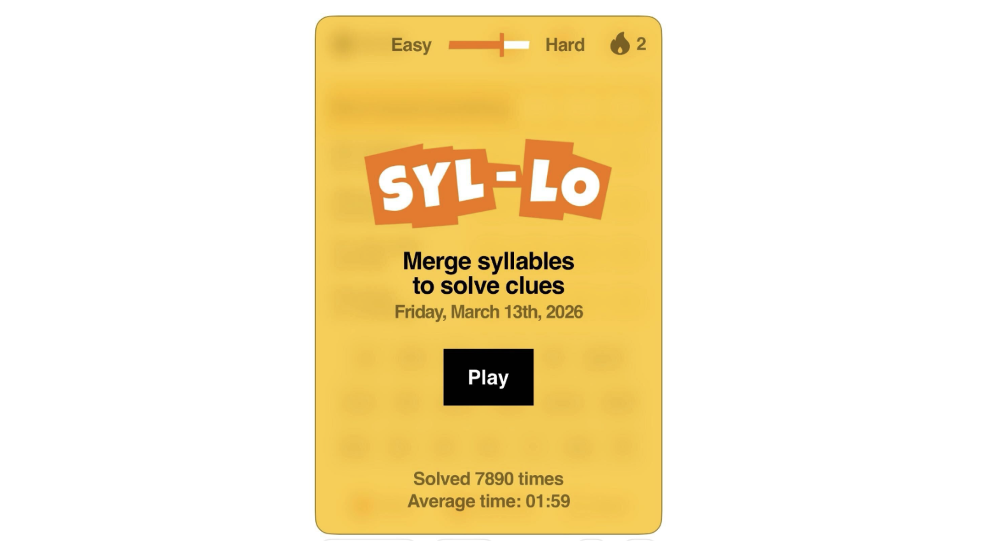
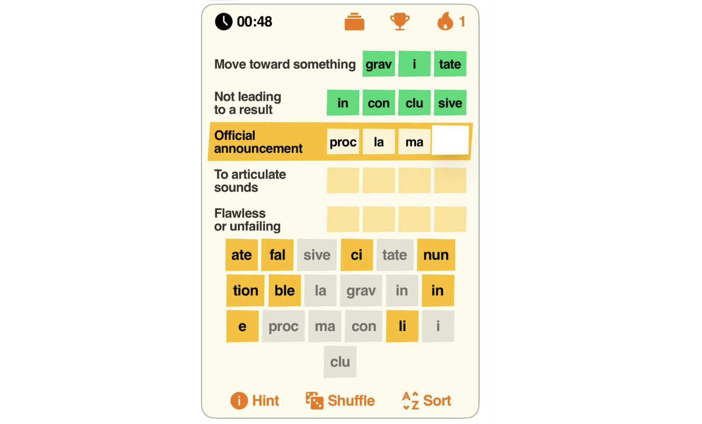
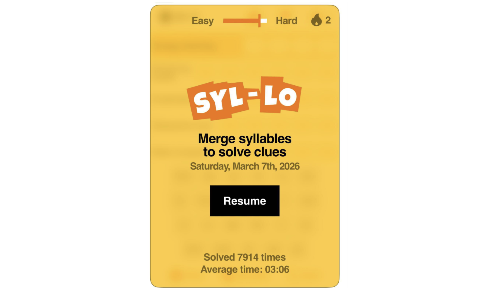
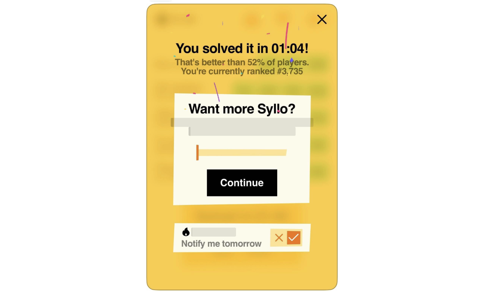

# Devvit Journeys

Devvit Journeys adds a telemetry stream to your app that tracks the entire lifecycle of a user session. With journeys, you can:

- Boost your game’s visibility and reach through richer gameplay insights.
- Make design and feature decisions based on real user data.
- Identify friction points and optimize for better user retention.

A journey has a defined start and end point. Progress is tracked throughout and ends with a completion status. You can also attach optional game-specific data (like win/loss results or scores) at the end.

:::note
This is currently an experimental feature, and you'll need to [apply](../analytics/analytics-overview.md#how-to-apply) for a spot in our beta program to implement Devvit Journeys.
:::

## Journey map

A journey map is a structured, instrumented flow that tracks a player’s progression through a specific experience in your game. Think of your journey map as a series of checkpoints (events) in your game, with:

- A clear **start condition** (e.g., game begins)
- Defined **end conditions** (e.g., game ends, player quits, or player fails)
- Optional **metadata** you can attach along the way (score, outcome, time spent, etc.)

All journey maps must be reviewed and approved prior to activation to ensure they align with Reddit’s platform guidelines.

## Core events and API structure

The SDK provides a telemetry client via `@devvit/analytics/client/reddit`.

### Events

All events sent from the client are forwarded to the server, where they are enriched with standard metadata (such as app, installation, user, and post context) before being emitted as analytics events. You should set each event to fire with the corresponding trigger.

| Event Type                | Trigger                                                           | Required Fields      | Optional Fields                   |
| ------------------------- | ----------------------------------------------------------------- | -------------------- | --------------------------------- |
| **`App.Ready`**           | Fire when the game has finished loading and is interactive.       | None                 | None                              |
| **`Journey.Start`**       | Fire when the user explicitly begins a session (not on app load). | None                 | None                              |
| **`Journey.Progress`**    | Fire when the user reaches a meaningful milestone.                | `progress` (0.0–1.0) | `action`, `actionDetails`         |
| **`Journey.Interaction`** | Fire for granular, stateless user interactions.                   | `action`             | `actionDetails`                   |
| **`Journey.End`**         | Fire when the session concludes.                                  | None                 | `complete`, `game { win, score }` |

### Journey ID handling

The client automatically manages the `journeyId`. You do **not** need to pass it to any method.

- A journey ID is generated server-side when `startJourney()` is called
- The client stores it in `sessionStorage` for the duration of the browser session
- Calls to `progress()`, `interaction(),` and `end()` automatically include the active journey ID

### Auto-start behavior

If `progress()` or `interaction()` is called before a journey has started, the client will automatically start a new journey.

### Ending a journey

Calling `endJourney()`:

- Sends a `Journey.End` event
- Clears the stored journey ID from `sessionStorage`

This allows a new journey to begin within the same session.

## Game-specific use cases

This example shows how a simple word game session can be represented as a Journey using four key events: `app.ready`, `journey.start`, `journey.interaction`, and `journey.end`. Together, these events capture the full lifecycle of a single play session, from when the game finishes loading to when the player completes the puzzle.

The screenshots illustrate a typical flow:

1. The game loads and signals it’s ready (`app.ready`).



2. The player begins playing a new word challenge (`journey.start`).



3. The player pauses mid-game (`journey.interaction`).



4. The player completes the puzzle (`journey.end`).



By instrumenting these moments, you can track session boundaries, understand player behavior during gameplay, and measure completion outcomes for the word game experience. See more example scenarios below.

### Scenario 1: standard level-based game

| Step  | Player Action                         | Event Fired             | Notes                         |
| :---: | ------------------------------------- | ----------------------- | ----------------------------- |
| **1** | Game loads                            | **App.Ready**           | Game is fully interactive     |
| **2** | Player clicks “Start Game”            | **Journey.Start**       | Begins a new session          |
| **3** | Player completes Level 1(of 5 levels) | **Journey.Progress**    | `progress: 0.2`               |
| **4** | Player opens inventory                | **Journey.Interaction** | `action: "menu_opened"`       |
| **5** | Player completes Level 2              | **Journey.Progress**    | `progress: 0.4`               |
| **6** | Player reaches final level            | **Journey.Progress**    | `progress: 0.9`               |
| **7** | Player defeats final boss             | **Journey.End**         | `complete: true`, `win: true` |

### Scenario 2: player fails mid-game

| Step  | Player Action                | Event Fired          | Notes                           |
| :---: | ---------------------------- | -------------------- | ------------------------------- |
| **1** | Game loads                   | **App.Ready**        | Game is fully interactive       |
| **2** | Player clicks “Start Game”   | **Journey.Start**    | Begins a new session            |
| **3** | Player completes early level | **Journey.Progress** | `progress: 0.3`                 |
| **4** | Player dies                  | **Journey.End**      | `complete: false`, `win: false` |

### Scenario 3: early exit / abandonment

| Step  | Player Action              | Event Fired             | Notes                     |
| :---: | -------------------------- | ----------------------- | ------------------------- |
| **1** | Game loads                 | **App.Ready**           | Game is fully interactive |
| **2** | Player clicks “Start Game” | **Journey.Start**       | Begins a new session      |
| **3** | Player pauses              | **Journey.Interaction** | `action: "pause_clicked"` |
| **4** | Player quits game          | **Journey.End**         | `complete: false`         |

## Guidelines

To ensure the integrity and quality of the telemetry stream, developers must follow these guidelines.

The platform may enforce validation checks to detect anomalous or exploitative event patterns. Failure to comply may result in delayed app approval or, in severe cases, removal from the platform.

### Event triggering

Events must reflect **intentional, committed user actions**.

- **Trigger on final commitment**.

  - Fire events only after a user has completed an action.
  - For interactions, this typically means using `mouseUp` or `touchEnd` (not initial input).

- **Avoid passive triggers**
  - Do not track views as journeys.
    - Do not use `Journey.Start` to record page or app views.
    - `Journey.Start` must represent an explicit user action (like pressing “Play”)
  - **Do not fire on pre-commitment input**
    - Avoid early input events such as `mouseDown` or `touchStart`
    - These interactions may be accidental or canceled before completion

### App allowlist

Telemetry is restricted by a server-side allowlist. Only approved apps can emit journey events. Requests from non-allowlisted apps will get a message that the event was dropped.

### Platform constraints

- **Devvit Web only**: Telemetry is only supported in Devvit Web apps (WebView).
- **Privacy**: Do **not** include PII (Personally Identifiable Information) in any user-defined fields (including `action` and `actionDetails`). You are responsible for ensuring all emitted data complies with privacy standards.

## Getting started

Follow these steps to implement journey tracking in your app.

### Server events

You can send events solely on the backend and use the front‑end only to establish and pass along the journeyId. To do this, thread the active `journey ID` from your front‑end to your backend routes.

```
import { telemetry } from '@devvit/analytics/client/reddit';

export async function submitScore(score: number): Promise<void> {
  const journeyId = telemetry.getActiveJourneyId();

  const response = await fetch('/api/score', {
    method: 'POST',
    headers: {
      'content-type': 'application/json',
      ...(journeyId ? { 'x-devvit-journey-id': journeyId } : {}),
    },
    body: JSON.stringify({ score }),
  });

  const data = (await response.json()) as { journeyId?: string };

  if (data.journeyId) {
    telemetry.setJourneyId(data.journeyId);
  }
}
```

On the server, read the incoming `journeyId` and use it for correlation in your own route.

```
import express from 'express';
import { telemetry } from '@devvit/analytics/server/reddit';

const app = express();

app.use(express.json());

app.post('/api/score', async (req, res) => {
  const journeyIdHeader = req.header('x-devvit-journey-id');
  const journeyId = typeof journeyIdHeader === 'string' ? journeyIdHeader : '';

  console.log('score event', {
    journeyId,
    score: req.body.score,
  });

  await telemetry.endJourney({
    journeyId,
    complete: true,
    game: { win: true, score: req.body.score },
  });

  res.json({ ok: true });
});

```

### Client events

If you don’t want to manually send server-events, you can use the generic client side events. In this case, the `JourneyId` is handled. In this case, you won’t need to pass a `JourneyId` when calling progress and so forth. You also won’t need `telemetry.getActiveJourneyId()` unless you’re curious about that data.

Note: This also requires using the route adapters provided in `@devvit/analytics/server/reddit`

```
// client
import { telemetry } from '@devvit/analytics/client/reddit';

const activeJourneyId = telemetry.getActiveJourneyId();

await telemetry.progress({
  progress: 0.5,
  action: 'level_progress',
});

```

```
// server
import { createTelemetryRouter } from '@devvit/analytics/server/reddit';
app.use(createTelemetryRouter());

```
