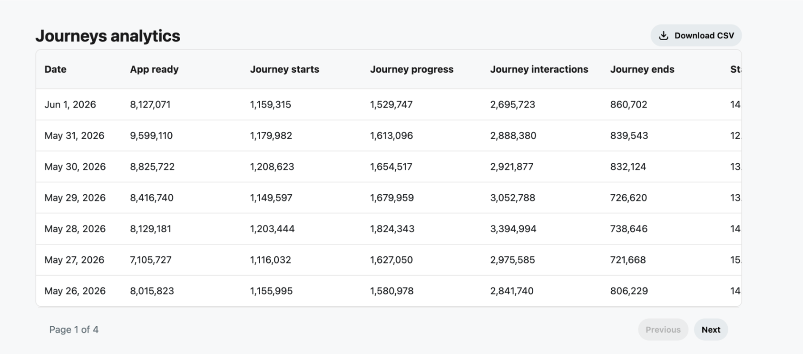

# Journeys Dashboard

Once you’ve implemented [Devvit Journeys](../docs/capabilities/analytics/devvit-journeys), you’ll be able to see how users are engaging with your app.  You’ll find Journeys analytics on the App Details page, under the Analytics tab. 

Journey metrics are displayed in a dedicated section below the existing engagement metrics.

## Understanding your data

Journey analytics data is aggregated into a single record per app per UTC day.  This data helps you understand the user’s experience of your app. At a high level: 

* **Start Rate**: Are users engaging with my app?  
* **Completion Rate**: Are users successfully finishing the game?  
* **Sessions per User**:  Are users coming back?  
* **Median Session Duration**: How much time are users spending in my app?  
* **Journey Progress & Interaction Events**: Where are users engaging or getting stuck?

## Journeys insights

Raw event counts show overall Journey activity and usage volume. 

Rate- and duration-based metrics help developers evaluate Journey adoption, engagement, and completion, making it easier to identify trends and diagnose issues.

| Metric | What it tells you |
| ----- | ----- |
| **utc\_day** | Lets you analyze app performance over time and identify trends, regressions, or the impact of releases. |
| **app\_ready\_count** | Shows how often the app was successfully loaded and available to users. Serves as the baseline for measuring adoption. |
| **journey\_start\_count** | Indicates how many times users began your game. Helps measure interest and discoverability of your app’s entry points. |
| **journey\_progress\_count** | Reveals how actively users move through your app. Sudden drops may indicate friction or confusing steps. |
| **journey\_interaction\_count** | Measures user engagement within your app. Helps identify whether users are actively interacting or passively abandoning flows. |
| **journey\_end\_count** | Shows how many users reached an end state. Useful for understanding overall throughput and completion volume of your game. |
| **start\_rate** | Measures the percentage of app loads that result in a user starting the game. Helps evaluate whether users are discovering and choosing to engage with your app. |
| **completion\_rate** | Measures the percentage of times a user has started your game and successfully reached completion. Helps identify drop-off problems and assess the effectiveness of your app’s design. |
| **sessions\_per\_day** | Shows how frequently users engage with your app on average. Helps distinguish between occasional use and repeat engagement. |
| **median\_session\_duration\_seconds** | Indicates how long users typically spend in your app. Helps assess game complexity, engagement depth, and the impact of changes to the game flow. |

You can download a CSV of your daily Journey metrics over a 30-day lookback period.
