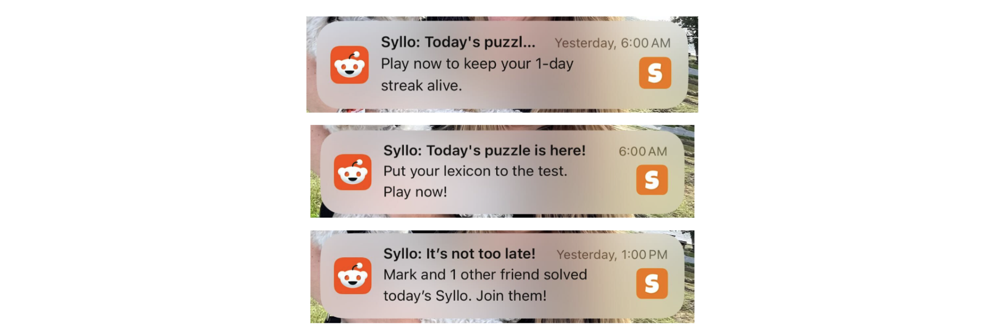
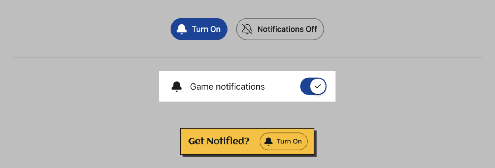

# Best Practices

Push notifications can help drive engagement, increase player retention, and build habit loops for players—all good things for your game. The examples below are from [Syllo](https://www.reddit.com/r/syllo/), a word game that integrated Push Notifications into the game experience.



This guide provides instructions for implementing developer-authored push notifications for Reddit games.

:::note
This is currently an experimental feature, and you'll need to [apply](../notifications/notifications-overview.md#how-to-apply) for a spot in our beta program to implement push notifications in your app.
:::

## How it works

### Push notification copy review

All push notifications in this Beta must be pre-approved by Devvit admins to ensure alignment with Reddit’s notification standards and content policy (see [Effective Copy](#write-effective-copy) for tips\!).

The Devvit team will review and approve all submissions before activation to ensure a safe and consistent experience across games.

Notifications should be:

- **Time-sensitive or highly important** (e.g., a new puzzle is available, a live event is starting, a challenge has ended).
- **Respectful and Reddit-appropriate**, avoiding spammy, click-bait, or overly promotional language.
- **Short and clear** — titles ≤ 60 characters, body ≤ 100 characters.
- **Transparent** about the context of the notification (what the user will see when they tap).

You can send a maximum of two push notifications per day per user.

### Opt-in / opt-out UX

Push notifications are opt-in only. and this is enforced at the API level. In the future, additional opt-out controls will also be available in Reddit settings.

Games must provide an in-game notifications control that:

- Allows users to explicitly turn notifications on and off
- Clear text indicating the user’s current state (on or off) on the initial screen

#### UX best practices

- Use Reddit’s notification-on and notification-off icons
- Clearly indicate if game notifications are on or off
- Always provide an easy way to toggle on or off notifications from your initial app view or a settings page
- Show visual confirmation of actions, like adding a “Notifications enabled” toast or change to the button styling

#### Component examples



## Designing high-quality notifications

Push notifications are most effective when strong content and strong copy work together. High-quality messages start with meaningful in-game events and use clear, motivating language to bring that value to life.

### Create meaningful events

Your push notifications should deliver clear, immediate value to players.

- **Make player progress visible**. Streaks make player progress tangible and gives players a clear, low-effort goal: show up, keep the streak alive, and continue progressing. **Make sure to include the number of days in the streak**. This makes the player’s progress concrete and strengthens their motivation to return to keep it going.


- **Provide tangible player benefits**. Tie notifications to real outcomes, like rewards ready to claim, streak milestones, live games, or limited-time challenges. Give the user a clear payoff for returning to the game. High-value events drive high conversion. If there’s no clear payoff, it’s better not to send the notification at all.


- **Layer urgency onto broadly relevant moments**. Create momentum by promoting events that are time-sensitive (“happening now” or “ending soon”) and matter to a wide audience, like a daily puzzle going live or the final hour of a tournament.


- **Treat pushes as a limited resource**. Use notifications selectively for moments where value is obvious at a glance, like completing a weekly challenge, collecting a reward, joining a live match, or entering a newly unlocked mode. These are the moments most likely to drive immediate play and long-term retention.

### Optimize timing

Send push notifications when players are most likely to engage with your game.

- **Localize delivery by user time zone**

  - Schedule sends using the player’s local time, not a single global batch time.
  - Treat night-time sends as disallowed by default; players are more likely to mute or opt out if they’re woken up or interrupted late.

- **Aim for late afternoon to early evening**

  - Platform data shows peak PN opens in late afternoon and early evening by GEO. Use this as the default window if you don’t have game-specific signals.
  - Start with a conservative window like **16:00–21:00 local time**, then refine based on your game’s metrics (CTR and disable rates).

- **Align timing to moments of natural intent**

  - For streak reminders, send close to when players typically play (e.g., a few hours before their usual daily play time), not as a “last second” midnight panic.
  - For event and reward PNs, send:
    - Shortly before the value becomes available (e.g., event starting soon, reward about to unlock), or
    - When the value is immediately redeemable and you can deeplink straight into the relevant screen.
  - Avoid “just because it’s morning” or daily cron-style sends; timing should always correspond to a clear in-game reason to come back right now.

- **Use timing metrics to iterate**
  - Track **CTR by hour-of-day and day-of-week** in local time buckets for your game.
  - Watch **notification disable rates** after bursts of sends; spikes usually mean you’re hitting players at the wrong time (too early, too late, or too often).
  - If you don’t have enough volume for fine-grained experiments, stick to:
    - No night-time delivery
    - Late afternoon/evening windows
    - Only sending when a concrete, time-bound value is available (streak, event, reward).

### Write effective copy {#write-effective-copy}

Push notifications act as **motivational nudges** that get to the crux of why users are playing your game. Here are some ways you can incorporate these nudges into your game.

- **Add behavioral triggers**. Behavioral triggers respond to real user actions, like completing tasks, returning after a break, or reaching milestones. This makes each message feel timely and personal. Examples might include:

  - “You’re 1 game away from finishing your weekly challenge\!”
  - “You were in the top 5% last week—can you do it again?”
  - “You have 2 new puzzles waiting for you\!”

- **Engage with social dynamics**. Highlighting status changes and community milestones inspire connection and friendly competition. Examples might include:

  - “Your team just moved up a division\! Jump in to keep the momentum going\!”
  - “Someone just stole your place on the leaderboard. Want it back?”

- **Leverage personal motivation.** The user’s history with the game reinforces progress. Examples might include:
  - “Your crops are thriving\! Come collect your rewards\!”
  - “You’re close to genius rank\! Solve 3 more puzzles to claim your crown\!”
  - “You’re one mission away from unlocking your next rank\! Time to jump back into action\!”

To learn more about creating deeper engagement loops, check out the best practices for [building community games](https://developers.reddit.com/docs/guides/best-practices/community_games).

## Adding push notifications to your app

### Step 1: Update the push notification module

In your terminal, navigate to your project directory and run this command to update the push notification to the latest release.

```
npm install @devvit/notifications
```

### Step 2: Import the push notification module

```
import { notifications } from '@devvit/notifications';
```

**Note**: If you already have the PN module, enter  
`npm install @devvit/notifications@next` to get the latest version.

### Step 3: Use bulk push notification endpoint with templating

To send a push notification to a group of users, you can use the double curly brackets ( { { } } ) to reference variables in a Mustache template.

```
await notifications.enqueue({
  title: 'Hello {{name}}!',
  body: 'You have {{score}} new points.',
  recipients: [
    {
      userId: 't2_abc123',
      link: 't3_xyz987',
      data: {
        name: 'Alex',
        score: '42',
      },
    },
    {
      userId: 't2_def456',
      link: 't3_xyz987',
      data: {
        name: 'Jordan',
        score: '7',
      },
    },
    {
      userId: 't2_ghi789',
      link: 't3_xyz987',
      data: {
        name: 'Sam',
        score: '13',
      },
    },
  ],
});
```

**Note:** Mustache templating is optional. Here's a simplified example without it:

```
await notifications.enqueue({
  title: 'Winner!',
  body: 'Congrats on your win',
  recipients: [
    {
      userId: 't2_abc123',
      link: 't3_xyz987',
    },
  ],
```

**Note**: If the app hasn’t been published, you can only send push notifications to yourself for testing. **Pre-release apps in testing are not subject to the rate-limits below**.

Once your app is published, you can pass different data per user for the same template. For each app, you can send:

- 2 push notifications per user per day\*
- Up to 25K per app per day

If you need higher limits, let us know.

### Step 4: opt-in / opt-out

Users will be able to opt in or out of receiving notifications triggered by a button in your UI:

```
await notifications.optInCurrentUser();
await notifications.optOutCurrentUser();
```

You will also be able to retrieve a list of users who have opted in (if not managing it manually):

```
//This will just return the first 1000 users
const recipients = await notifications.listOptedInUsers();

const recipients = await notifications.listOptedInUsers({
  after: '1764876078573:t2_ltrlsg7l',
  limit: 100,
});
```

The default and maximum limit is 1,000.

Usernames are returned in chronological order according to opt-in time, starting after the specified cursor. If the cursor is not found, results begin from the earliest opt-in time.
