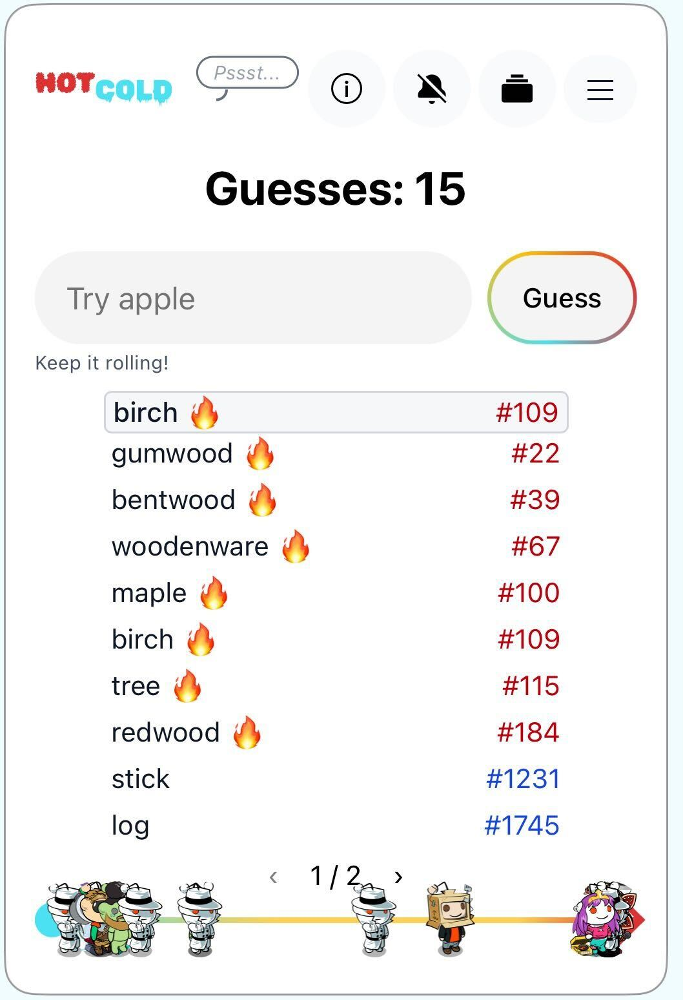
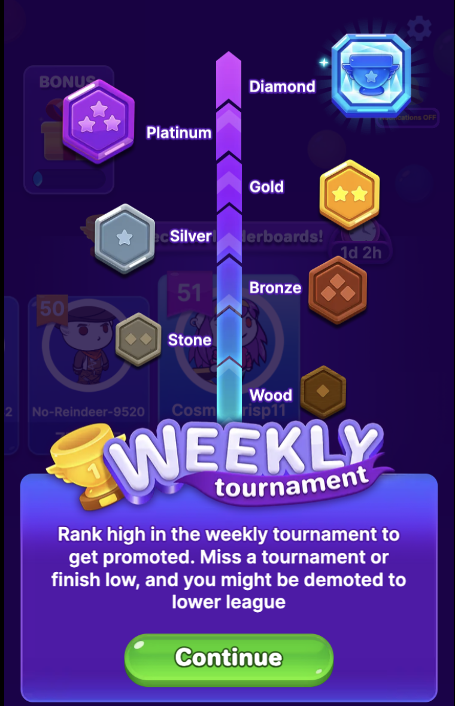
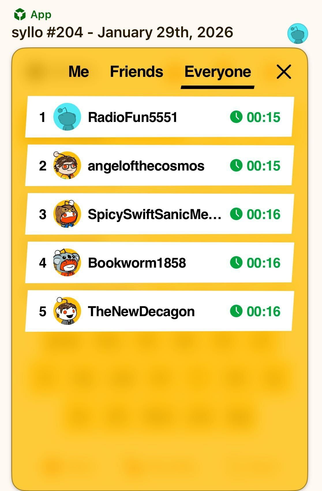
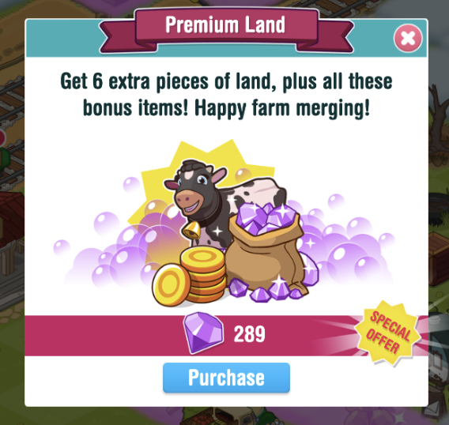

# Building Community Games

Community games are multiplayer experiences that tap into Reddit’s unique social dynamics.

This guide provides practical tips to help you create engaging community games that thrive in Reddit's ecosystem. Read on to learn about the kinds of mechanics that help drive long-term engagement and unlock a shot at [featuring placements](../launch/feature-guide.mdx) for your app.

## Player retention

Retention is the art of giving players a reason to come back tomorrow. Most successful games create simple, repeatable patterns that become part of the player’s daily routine.

### Add a subscribe option

One of the simplest ways to drive repeat play is to encourage users to subscribe to your subreddit. Subscribers will see new app posts and community discussions in their home feed, which organically brings them back to your game.

You can add a “Join” button in your app using the [user actions](../../capabilities/server/userActions.mdx) plugin. This creates a lightweight, opt-in way for players to stay connected and engaged.

### Habits and feedback loops

Build loops in your game that reward daily habits. **Streaks** and **milestone rewards** encourage consistency: players come back to maintain progress and reach the next goal. You’ll see streaks in games like [r/syllo](https://www.reddit.com/r/syllo/), and [r/honk](https://www.reddit.com/r/honk/) lets players earn loot by completing game levels. You can also add streaks to player flairs.

**Tip**: Consider adding grace mechanics like streak freezes to reduce churn.

**Push notifications** are another way to reinforce a daily habit, and they work best when paired with other retention features like streaks, leagues, and leaderboards. Push notifications are currently a limited beta feature, but you can reach out via [r/Devvit](https://www.reddit.com/r/Devvit/) modmail to apply for a spot in our beta program.

### Progress and recognition

Short-term and long-term goals give players something to work toward, and you’ll want to make progress visible and meaningful:

- Tie daily play to larger systems like **leagues** or **ranks** so that small actions contribute to bigger goals.
- Use visible status indicators like **flair** and **badges** to increase emotional investment in your game.

For short-term goals, [r/HotandCold](https://www.reddit.com/r/HotAndCold/) uses the fire emoji to let players know they’re on the right track, and keeps a progress bar with player avatars to see gameplay progress.

  

For long-term goals, [r/BubbleShooterPro](https://www.reddit.com/r/BubbleShooterPro/) sets up weekly tournaments to establish leagues and encourages players to return to try to get promoted to the next level.

  

### Competition and social pull

Reddit is inherently social, and it’s a natural fit for **leaderboards**. The daily leaderboard on [r/syllo](https://www.reddit.com/r/syllo/) gives everyone a fresh chance to compete each day.

  

Leverage the community to **highlight top contributors** or celebrate a “**player of the week**” in a way that's visible in the feed. Social visibility turns participation into status.

### Challenges and missions

Give players clear goals on a cadence to drive engagement:

- **Daily or weekly missions**. Short, achievable tasks create regular reasons to return, like:
- Solve today’s puzzle of [r/pocketgrids](https://www.reddit.com/r/pocketgrids/)
- Submit a drawing in [r/Pixelary](https://www.reddit.com/r/Pixelary/)
- Complete a mission in [r/PlaySpies](https://www.reddit.com/r/PlaySpies/)

- **Rotating or seasonal events**. Create limited-time themes and special events to keep content fresh and give players urgency.

### Reward systems

Use rewards to reinforce meaningful participation. Allow players to accumulate **points** they can **redeem** for perks or other in-game advantages. In [r/FarmMergeValley](https://www.reddit.com/r/FarmMergeValley/), players earn diamonds they can use toward things like purchasing land for their farm.

  

**Tip**: Align incentives with community values. High-quality contributions should earn more than low-effort ones.

## Why retention matters for featuring

Reddit prioritizes sustained engagement over short spikes.

Games that consistently bring players back through progression, competition, and repeatable loops build strong retention curves. That ongoing engagement demonstrates lasting community value, which is a key factor in featuring decisions.

## Core design principles

Use these principles to build for return visits, not just first plays.

| Principle                 | Execution                                                                                                                                                                                                                                                                                                                                                                               | Example                                                                                                                                                                                        |
| ------------------------- | --------------------------------------------------------------------------------------------------------------------------------------------------------------------------------------------------------------------------------------------------------------------------------------------------------------------------------------------------------------------------------------- | ---------------------------------------------------------------------------------------------------------------------------------------------------------------------------------------------- |
| Keep it bite-sized        | · Focus on quick gameplay loops. · Reduce time to fun — players should be engaged within seconds. · Smaller scope means faster development and easier maintenance.                                                                                                                                                                                                                | [r/chessquiz](https://www.reddit.com/r/chessquiz/) delivers daily puzzles instead of full matches.                                                                                             |
| Design for the feed       | · Make the first screen eye-catching · Include a clear, immediate call to action · Remember you’re competing with everything else in the feed                                                                                                                                                                                                                                     | [r/Pixelary](https://www.reddit.com/r/Pixelary/) shows the canvas immediately.                                                                                                                 |
| Build Content Flywheels   | Reddit posts decay quickly. Your game needs a strategy to stay relevant.  **Option A: Scheduled content** · Daily or weekly challenges · Automated post creation · Recurring tournaments  **Option B: Player-generated content** · Gameplay creates new posts or comments · Players generate the content · Include moderation systems for quality control | [r/Sections](https://www.reddit.com/r/Sections/) schedules a new puzzle every day.  [r/captioncontest](https://www.reddit.com/r/captioncontest/) turns submissions into ongoing content. |
| Embrace asynchronous play | · Players can participate anytime · Lower commitment per session · Works across time zones · Scales more easily                                                                                                                                                                                                                                                                | [r/BlinkWords](https://www.reddit.com/r/BlinkWords/) is available for players any time.                                                                                                        |
| Scale from one to many    | Your game should be fun at any player count: · A strong single-player baseline · Smooth scaling as more players join · Leaderboards or shared goals to add competition                                                                                                                                                                                                         | [r/DarkDungeonGame](https://www.reddit.com/r/DarkDungeonGame/) works solo but improves with collaboration.                                                                                     |

## Getting featured

Check out the [Feature Guide](../launch/feature-guide.mdx) to learn more about how Reddit helps your game get discovered.
