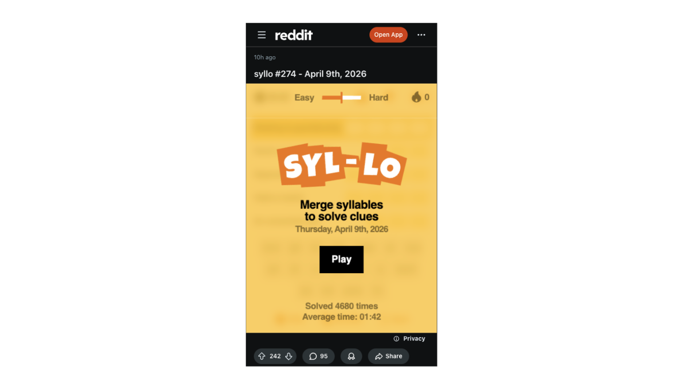
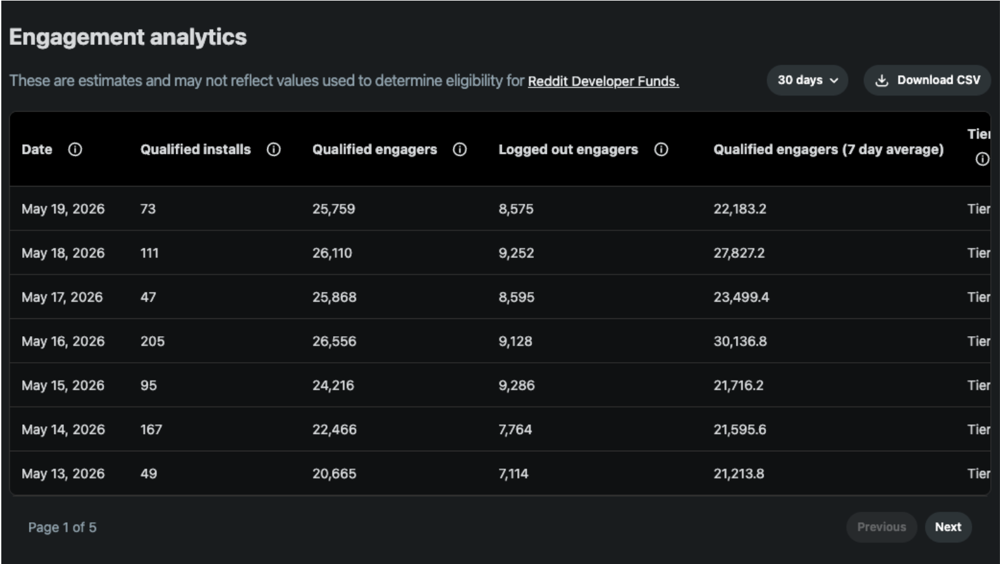
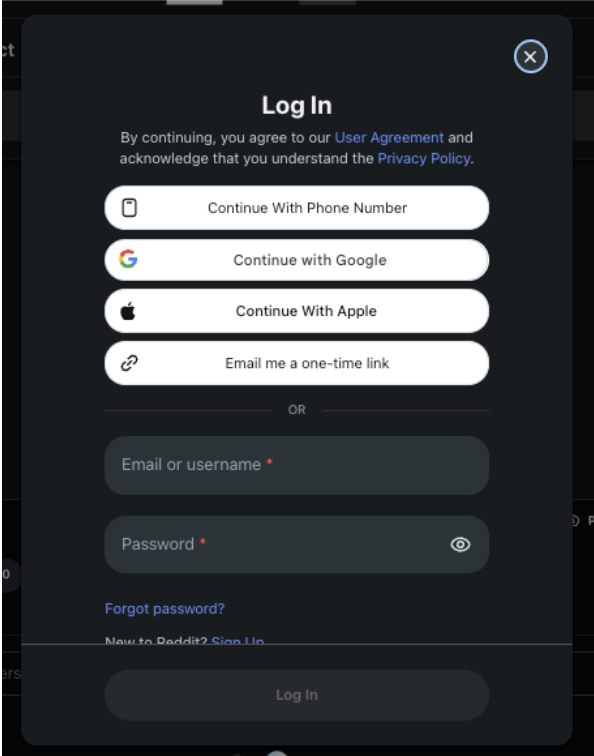
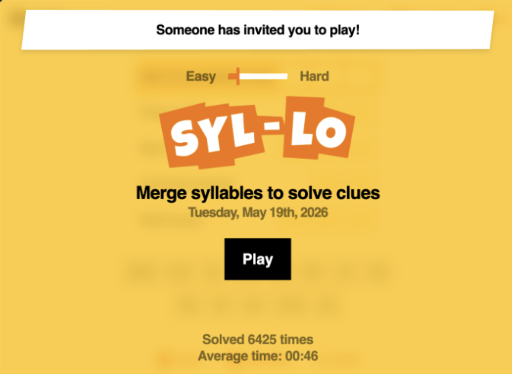
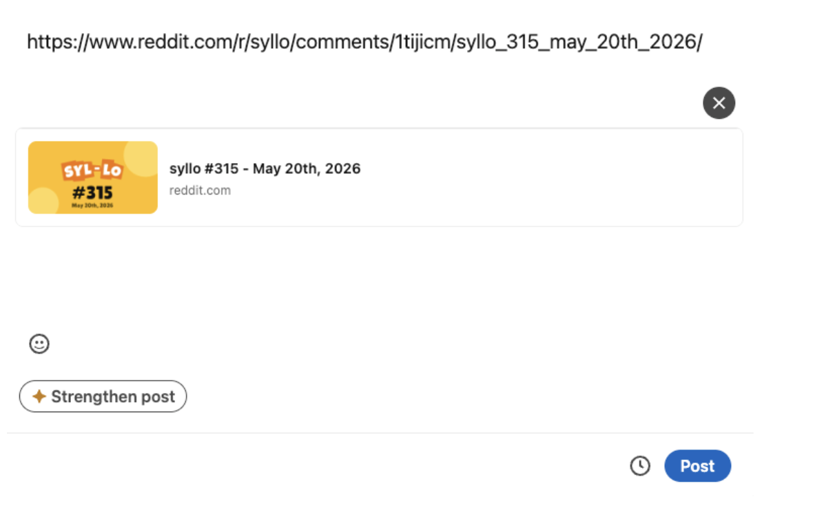

# Building for Logged Out Players

Reddit has a large base of logged out users who arrive through SEO, shared links, or directly on reddit.com. Your game should support logged out users so that you can reach a larger audience, and you can create a path to convert those users into Reddit accounts who can subscribe to your game and come back to play more.

This guide shows you how to design a Devvit game for logged-out traffic:

- Make your game playable for logged out users: don't gate the core experience behind a login wall.
- Prompt users to log in at the right moment so they can subscribe to or follow your game.
- Optimize sharing so shared links and previews attract new players.
- Save the game state across the login boundary so logged out users who create an account can continue seamlessly after signing up.

## Design for logged out users



### Create "just play" sessions

Logged-out users:

- Often arrive via search or shared links
- Lack context (no comments, subscriptions, or community cues)

Recommended patterns:

- Make the entry point obvious (e.g., a clear "Play" button)
- Provide in-game instructions (don't rely on external UI)
- Don't require login to start gameplay
- Reserve advanced features (saved progress, leaderboards, social) for logged-in users

### Detect user state

Distinguish between logged-in and logged-out users in your app logic. In Devvit, use the context:

- `context.userId` is present only when the user is logged in
- `context.appSlug`, `context.postId`, etc. are available in both cases

```ts
import type { Context } from "@devvit/public-api";

export async function onPlay(context: Context) {
  const isLoggedIn = Boolean(context.userId);

  if (!isLoggedIn) {
    // Logged-out experience: ie, no comments or "run as user" actions
    // Keep the focus on playing the level.
  } else {
    // Enable richer features for logged-in players.
  }
}
```

This pattern is especially important once you start using the login effect to gate certain actions (saving progress, sharing, etc.) behind a login flow.

**Analytics and RDF**

Your app's analytics dashboard distinguishes logged-in vs logged-out users.

Note: logged out traffic does not count towards qualified engagement for Reddit Developer Funds.



## Prompt users to log in

The biggest reason to convert a logged-out player into a logged-in user is retention: a logged-in user can subscribe to your subreddit, follow your game, and receive notifications that bring them back. A logged-out player who closes the tab is gone.

Use `showLoginPrompt` to trigger Reddit's login/sign-up flow at a moment you choose. After the user creates or logs into their account, they return to your game.



### When to prompt

Trigger `showLoginPrompt()` during user actions where logging in unlocks something the player already wants, such as:

- Subscribing to your game's subreddit (highest-leverage moment for retention)
- Following your game for updates or notifications
- Saving progress
- Sharing results
- Accessing social features (leaderboards, comments)

### Best practices

#### Only prompt logged-out users

Check if the user is already logged in. If so, don't trigger the login effect.

```ts
import type { Context } from "@devvit/public-api";
import { showLoginPrompt } from "@devvit/client";

export async function onLoginButtonClick(context: Context) {
  if (context.userId) {
    return;
  }

  showLoginPrompt();
}
```

#### Trigger at natural breakpoints

The login/sign-up flow reloads the page, so any in-memory game state will be lost unless you s[ave the logged-out game state](#save-the-logged-out-game-state).

Recommendations:

- Trigger `showLoginPrompt()` only at natural stopping points, e.g.:
  - After a level is completed
  - On a results or summary screen
  - Before starting a new game
- Avoid prompting:
  - Mid-puzzle or in the middle of an action that can't easily be resumed
  - Repeatedly on every play; repeated prompts are likely to be ignored

#### Pair the prompt with a clear value proposition

Before triggering the prompt, show in-game messaging that tells the user _why_ they should log in. "Sign in to save game data and subscribe" converts better than a bare login dialog.

:::note

Your CTA must let the user know their game data will be saved when they subscribe.

:::

**Example: gating a "save progress" feature**

```ts
import type { Context } from "@devvit/public-api";
import { showLoginPrompt } from "@devvit/client";

export async function onSaveProgress(context: Context) {
  const isLoggedIn = Boolean(context.userId);

  if (!isLoggedIn) {
    // Optional: show in-game messaging before the prompt.
    // e.g. render "Sign in to save your progress" in your own UI.

    showLoginPrompt();
    return;
  }

  // User is logged in; proceed with your normal save logic.
  await saveProgressForUser(context);
}
```

## Customize sharing to attract new players

Shares are one of the main ways logged-out users arrive at your game. A well-customized share gives the recipient a clear reason to play and a clean landing experience, instead of a generic Reddit preview.

There are three pieces:

1. `showShareSheet` to trigger sharing from inside your app
2. **Deeplinks** to attach up to 1024 characters of data to a shared link
3. **Share previews** to set the image and text shown when links unfurl off-platform

### Trigger sharing from your app

Use `showShareSheet` to invoke Reddit's share behavior from your app.

Example: display an invite banner



```ts
import { showShareSheet } from "@devvit/web/client";

await showShareSheet({
  title: "Play today's puzzle", // optional title
  text: "I solved the puzzle in 30s. Can you beat my time?", // optional body message
  data: JSON.stringify({
    // optional share data (≤ 1024 chars)
    type: "puzzle_challenge",
    from: "userA",
    message: "userA challenged you to solve this puzzle",
  }),
});
```

Parameters:

- `data?: string`
  - Arbitrary payload (invite code, JSON, etc.)
  - Must be **≤ 1024 characters**
  - Becomes the shared "user data" you can read when the link is opened
- `title?: string`
  - Optional title for the share sheet or message
- `text?: string`
  - Optional pre-filled message body
- `post?: T3` (on some platforms)
  - Optional; if omitted, the current Devvit post is used

You don't need to build your own share URLs for the standard "share this post" flow. `showShareSheet` handles that for you.

### Share data and deeplinks

Attach extra `data` to shared links and read it back when a recipient opens them using `getShareData()`.

**Writing share data**

Best practices:

- Keep it short (≤ 1024 characters)
- Treat share data as untrusted input (users can tamper with links). Do **not** trust share data as an identity or authorization token
- Validate before using the payload

**Reading share data when the page loads**

```ts
import { getShareData } from "@devvit/web/client";

const raw = getShareData();
const shared = raw ? JSON.parse(raw) : undefined;

if (shared?.type === "puzzle_challenge") {
  // Render challenge UI for the recipient.
}
```

### Customize share previews

Set custom share images and text for each post instead of showing the default Reddit branding. This image is used for the thumbnail preview in compact subreddit feeds and for off-platform link unfurls.



**Set share image when creating a post**

```ts
// 1. Upload your image to Reddit via the media API.
import { media } from "@devvit/web/server";

async function uploadShareImageUrl(): Promise<string | undefined> {
  try {
    const uploadResult = await media.upload({
      url: "https://example.com/share-preview.png",
      type: "image",
    });
    return uploadResult.mediaUrl;
  } catch (error) {
    console.error(`Failed to upload share image: ${error}`);
    return undefined;
  }
}

// 2. Use the returned mediaUrl in submitCustomPost.
const shareImageUrl = await uploadShareImageUrl();
const post = await reddit.submitCustomPost({
  title: "Daily Post",
  subredditName: subreddit.name,
  ...(shareImageUrl ? { shareImageUrl } : {}),
});
```

**Update share image for an existing post**

```ts
const post = await context.reddit.getPostById(context.postId);

await post.setShareImageUrl("https://example.com/new-share-image.png");
```

Notes:

- Use a **static image URL** with appropriate resolution and aspect ratio
- The same image is used across major destinations (iMessage, WhatsApp, SMS, Slack, etc.)
- If you don't set a share image, Reddit uses a default app or post-level preview

## Save the logged-out game state

To make this a good experience for logged-out users who convert to logged-in users, you can save their game state across the login boundary. This example shows how to save a simplified completed game state (`score`) using the browser’s localStorage.

:::note

You should only collect and retain data strictly necessary for gameplay engagement and continuity. Game engagement data must not be used for advertising, profiling, personalization outside the gameplay experience, or any unrelated secondary purposes.

:::

Saving game state to localStorage comes with some limitations: localStorage resets whenever you install a new app version, and it does not persist across different browsers.

### Set up localStorage helpers

```javascript
type LoggedOutScore = {
  postId: string;
  score: number;
};

const loggedOutScoreKey = (postId: string) => `mygame:loggedOutScore:${postId}`;

export function writeLoggedOutScoreToLocalStorage(value: LoggedOutScore): void {
  try {
    window.localStorage.setItem(
      loggedOutScoreKey(value.postId),
      JSON.stringify(value)
    );
  } catch {
    // Add error handling
  }
}

export function readLoggedOutScore(postId: string): LoggedOutScore | null {
  try {
    const raw = window.localStorage.getItem(loggedOutScoreKey(postId));
    if (!raw) return null;

    const parsed: unknown = JSON.parse(raw);
    if (
      !parsed ||
      typeof parsed !== "object" ||
      typeof (parsed as LoggedOutScore).postId !== "string" ||
      typeof (parsed as PendingScore).score !== "number"
    ) {
      return null;
    }

    return parsed as LoggedOutScore;
  } catch {
    return null;
  }
}

export function clearLoggedOutScore(postId: string): void {
    window.localStorage.removeItem(loggedOutScoreKey(postId));
}
```

### Game ends: save the score from this logged-out game

- If the user is logged in: send the data to Redis using `username` / `userId` from the session.
- If not logged in: `JSON.stringify` the score and `localStorage.setItem` under a key that includes postId (or some other unique identifier, ie `gameId`, depending on your app setup) so different posts don't get mixed up.

```javascript
async function onGameEnd(postId: string, userLoggedIn: boolean, score: number) {
  if (userLoggedIn) {
    await saveScore(postId, score);
    clearLoggedOutScore(postId);
  } else {
    writeLoggedOutScoreToLocalStorage(postId, score);
  }
}

async function saveScore(
  input: { postId: string; score: number },
  context: { userId: string }
) {
  const { userId } = context;
  if (!userId ) throw new Error("userId required");
  if (!postId) throw new Error("postId required");

  await redis.hSet(`scores:${input.postId}`, {
    [userId]: String(input.score),
  });

  return { status: "ok" };
}
```

### Migrate logged-out user scores to their userId when they log in

- Next time the app runs and userId is present, save the score from localStorage to the user’s id in redis so that they get the credit for completing the game

```javascript
async function migrateLoggedOutScoreOnAppInit(params: {
  userId?: string;
  postId?: string;
}): Promise<void> {
  const { userId, postId } = params;
  if (!userId || !postId) return;

  const loggedOutScore = readLoggedOutScore(postId);
  if (!loggedOutScore) return;

  await saveScore({
    postId: loggedOutScore.postId,
    score: loggedOutScore.score,
  });

  clearLoggedOutScore(postId);
}
```
